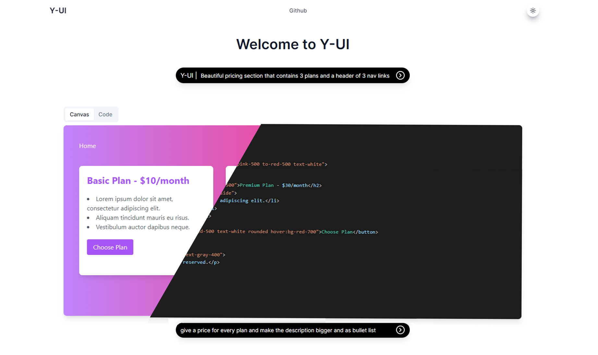

# Y-UI: Next.js 13, React, Tailwind, OpenAI

Generate UI components in React styled with tailwindCss using openAI API.

### Demo

Here is a link for the demo : <strong> <a href="https://y-ui.vercel.app/">Demo</a></strong>



### Cloning the repository

```shell
git clone https://github.com/yaserrar/y-ui
```

### Install packages

```shell
npm i
```

### Setup .env file

```js
OPENAI_API_KEY=
```

### Start the app

```shell
npm run dev
```
